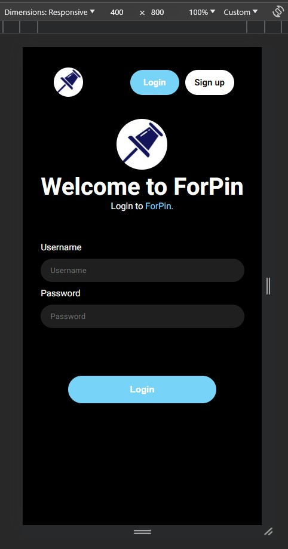
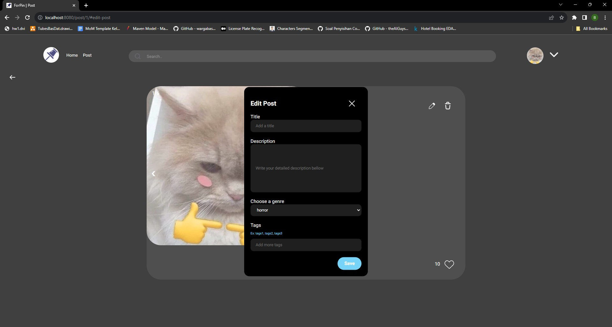
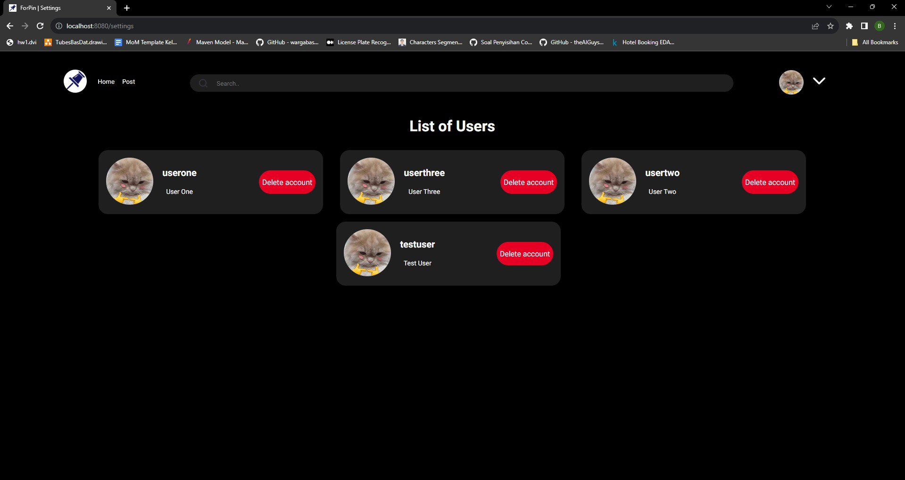
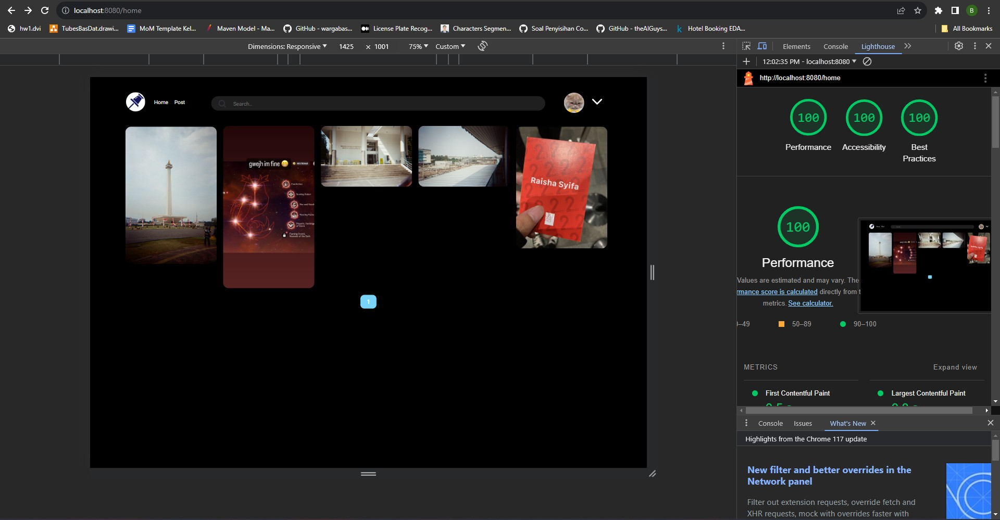

# ForPin

> Disusun untuk memenuhi Tugas Milestone 1 IF3110 - Monolithic PHP & Vanilla Web Application

## Daftar Isi

-   [Deskripsi Aplikasi Web](#deskripsi-aplikasi-web)
-   [Struktur Program](#struktur-program)
-   [Daftar Requirement](#daftar-requirement)
-   [Cara Instalasi](#cara-instalasi)
-   [Cara Menjalankan Server](#cara-menjalankan-server)
-   [Screenshot Tampilan Aplikasi](#screenshot-tampilan-aplikasi)
-   [Entity Relationship Diagram](#entity-relationship-diagram)
-   [Pembagian Tugas](#pembagian-tugas)
-   [Google Lighthouse](#google-lighthouse)

## Deskripsi Aplikasi Web

Setelah diminta untuk membangun 1000 startup oleh Teh Roro, Kang Bondowoso memutuskan untuk membangun startup yang bernama ForPin Company Limited sebagai salah satu dari 1000 startup tersebut. ForPin Company Limited akan membuat sebuah aplikasi yang bernama **ForPin** yang dapat digunakan untuk berbagi foto/video. Kang Bondowoso memutuskan untuk membuat **ForPin** agar bisa menyimpan dan membagikan foto-foto pernikahannya dengan Teh Roro (katanya biar ~~mantannya~~ temennya bisa lihat). Namun karena Kang Bondowoso berasal dari jurusan Teknik Percandian, dia tidak memiliki pengetahuan dan kemampuan untuk membuat aplikasinya. Karena itu Kang Bondowoso memutuskan untuk meminta bantuan para ~~budak tubes~~ jin kesayangannya (yang tentunya sangat berpengalaman dalam membuat web 🙄👍) untuk membuat aplikasi ini dalam semalam. Berdasarkan hasil diskusi para ~~budak tubes~~ jin (ngga diskusi sih, Kang Bondowoso yang nyuruh), para jin memutuskan untuk membuat aplikasi tersebut menggunakan DBMS (PostgreSQL) dan PHP murni beserta HTML, CSS, dan Javascript.

## Struktur Program

```
.
│   .env
│   .gitignore
│   docker-compose.yml
│   Dockerfile
│   favicon.ico
│   index.php
│   README.md
│
├───scripts
│       build-image.sh
│
├───public
│   │
│   ├───css
│   │       carousel.css
│   │       create.css
│   │       edit_profile.css
│   │       exceptionerror.css
│   │       globals.css
│   │       header.css
│   │       homepage.css
│   │       login.css
│   │       modal.css
│   │       post_viewer.css
│   │       post.css
│   │       profile.css
│   │       settings.css
│   │       signup.css
│   │
│   ├───images
│   │   │
│   │   │   dropdown_sign.png
│   │   │   error.gif
│   │   │   log.png
│   │   │
│   │   └───testing_images
│   │           1.jpeg
│   │           2.jpeg
│   │           3.jpeg
│   │           4.jpeg
│   │           5.jpeg
│   │           6.jpeg
│   │           7.jpeg
│   │           8.jpeg
│   │           9.jpeg
│   │           10.jpeg
│   │           11.jpeg
│   │           12.jpg
│   │           13.png
│   │           14.jpg
│   │           15.jpg
│   │           16.jpg
│   │           17.jpg
│   │           18.jpg
│   │           19.jpg
│   │           20.jpg
│   │           21.jpg
│   │           22.gif
│   │           xavier.mp4
│   │
│   └───javascript
│       │
│       ├───create
│       │       fileupload.js
│       │
│       ├───debounce
│       │       debounce.js
│       │
│       ├───exceptionerror
│       │       exceptionerror.js
│       │
│       ├───login
│       │       login.js
│       │
│       ├───navbar
│       │       navbar.js
│       │
│       ├───post
│       │       carousel.js
│       │       edit.js
│       │       post.js
│       │
│       ├───post_viewer
│       │       post_viewer.js
│       │
│       ├───profile
│       │       edit_profile.js
│       │       profile.js
│       │
│       ├───signup
│       │       signup.js
│       │
│       └───signup
│               1.jpeg
│               2.jpeg
│               3.jpeg
│               4.jpeg
│               5.jpeg
│               6.jpeg
│               7.jpeg
│               8.jpeg
│               9.jpeg
│               10.jpeg
│               11.jpeg
│               12.jpg
│               13.png
│               14.jpg
│               15.jpg
│               16.jpg
│               17.jpg
│               18.jpg
│               19.jpg
│               20.jpg
│               21.jpg
│               22.gif
│               xavier.mp4
│
├───psql
│
├───migrations
│       init.sql
│
└───app
    │   .htaccess
    │   init.php
    │
    ├───config
    │       config.php
    │
    ├───config
    │       Create.php
    │       Exceptionerror.php
    │       Home.php
    │       Post.php
    │       Profile.php
    │       Settings.php
    │       User.php
    │
    ├───core
    │       App.php
    │       Controller.php
    │       Database.php
    │
    ├───exceptions
    │       LoggedExceptions.php
    │
    ├───middlewares
    │       Token.php
    │
    ├───models
    │       Image_model.php
    │       Post_model.php
    │       User_model.php
    │       User_post_model.php
    │       Video_model.php
    │
    └───views
        ├───component
        │       login.php
        │       navbar-login.php
        │       navbar.php
        │       post_viewer.php
        │       signup.php
        │ 
        ├───create
        │       index.php
        │ 
        ├───exceptionerror
        │       index.php
        │
        ├───home
        │       index.php
        │
        ├───post
        │       NotFoundPage.php
        │
        ├───profile
        │       edit.php
        │       index.php
        │
        ├───settings
        │       index.php
        │
        └───user
               index.php
               login.php
 
```

## Daftar Requirement

1. Login
2. Register
3. Home
4. Search, Sort, dan Filter Navbar
5. Tambah Post
6. Detail Post
7. Edit Post
8. Detail User
9. Edit User
10. Daftar User
11. Error Page

## Cara Instalasi

1. Lakukan pengunduhan repository ini dengan menggunakan daftar perintah git clone https://gitlab.informatika.org/WBDKelompok4/tugas-besar-1.git pada terminal komputer Anda. 
2. Pastikan terdapat aplikasi Docker pada komputer.
3. Buatlah sebuah .env yang bersesuaian dengan penggunaan (contoh file .env dapat dilihat pada `.env.example`)

## Cara Menjalankan Server

1. Program ini dapat dijalankan dengan menjalankan perintah docker-compose up --build pada terminal di root directory aplikasi web.
2. Aplikasi web dapat diakses dengan menggunakan browser pada URL https://localhost:80 atau `https://localhost:80/`.
3. Aplikasi web dapat dihentikan dengan menjalankan perintah docker-compose down pada terminal di root directory aplikasi web.

## Screenshot Tampilan Aplikasi

### Login



### Register


### Home


### Search, Sort, dan Filter


### Tambah Post


### Detail Post


### Edit Post




### Detail User


### Edit User


### Daftar User




### Error Page


## Entity Relationship Diagram


## Pembagian Tugas

### Server Side

| Fitur                             | NIM                           |
| --------------------------------- | ----------------------------- |
| Login                             | 13521156                      |
| Register                          | 13521156                      |
| Home                              | 13521069                      |
| Search, Sort, dan Filter          | 13521069                      |
| Tambah Post                       | 13521069, 13521156            |
| Detail Post                       | 13521156                      |
| Edit Post                         | 13521069, 13521156            |
| Detail User                       | 13521069, 13521156            |
| Edit User                         | 13521069, 13521156            |
| Daftar User                       | 13521156                      |
| Error Page                        | 13521069                      |

### Client Side

| Fitur                             | NIM                           |
| --------------------------------- | ----------------------------- |
| Login                             | 13521069, 13521156            |
| Register                          | 13521069, 13521156            |
| Home                              | 13521069, 13521156            |
| Search, Sort, dan Filter          | 13521069, 13521156            |
| Tambah Post                       | 13521069, 13521156            |
| Detail Post                       | 13521069, 13521156            |
| Edit Post                         | 10023082, 13521069, 13521156  |
| Detail User                       | 10023082, 13521069, 13521156  |
| Edit User                         | 13521069, 13521156            |
| Daftar User                       | 13521156                      |
| Error Page                        | 13521069                      |


## Google Lighthouse

### Login


### Register


### Home



### Search, Sort, dan Filter


### Tambah Post


### Detail Post


### Detail User


### Edit User


### Daftar User


### Error Page


